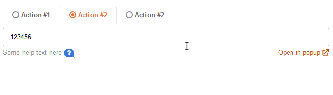

# BlockUI - block the whole page or any element

> Simple, useful and visually pleasing UX to respond to user interaction and indicate progress in the background.



### Usage:

Include jQuery & `blockui.min.js` into your page and:

```javascript
// one element:
$('.selector').block(); 
/* ➡️ */
$('.selector').unblock()


// full window:
$.blockUI(); 
/* ➡️ */ 
$.unblockUI()
```

Inspired by https://github.com/malsup/blockui
